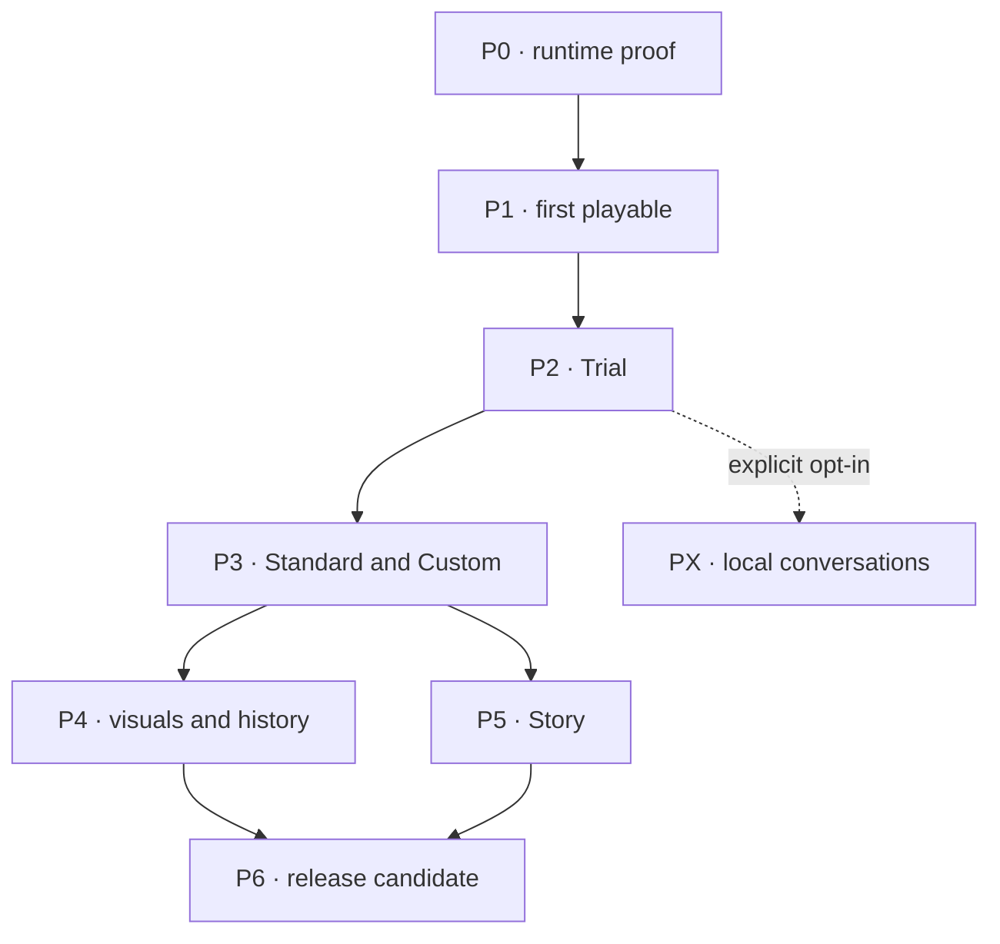

> **Historical document** from Development Kit v2 (Godot, eight agents). Kept for rationale. The web plan replaces its P0 and its orchestration; links were repointed where targets exist.

# The Last Clan — Agent Work Phases v2

11 September 2026 · Complete development orchestration plan for Jani.

**One game, one accepted baseline, eight specialized roles, 145 bounded work packets.** There are 139 required packets and six optional local-conversation packets. This is the work breakdown, not an estimate of 145 guaranteed one-chat completions. Difficult packets may be split while preserving all acceptance criteria. No game code or performance result is claimed by this planning kit.

## What this revision changes

Adopt contracts-first delivery, code-authored Godot scenes, real screenshot capture, a polished procedural character pipeline, per-packet handoffs and deterministic work ceilings. Retain the pure C# core, lawful bot knowledge, fixed ticks, traceable decisions and factual careers. Replace the old staffing calendar with observed agent throughput. Correct route-cache information leakage and require partial routes to prove progress. Complete the Custom, history, Story, beta and release work that was underspecified in the proposed phase plan.

The full revised technical baseline is The_Last_Clan_Technical_Plan_v1_1.md. The adopted rule clarifications are in The_Last_Clan_GDD_v1_1_Addendum.md. REVIEW_DECISIONS.md records all feedback decisions; GDD_TRACEABILITY.md maps the sixteen source concerns and all 51 acceptance scenes.

## Milestones and gates

| Phase | Deliverable | Packets | Exit gate |
| --- | --- | --- | --- |
| P0 (retired; see W0) | Foundation and runtime proof | 17 | G0 |
| [P1](kit_phases/P1.md) | First playable | 35 | G1 |
| [P2](kit_phases/P2.md) | 24-person Trial | 26 | G2 |
| [P3](kit_phases/P3.md) | Complete Standard and Custom | 20 | G3 |
| [P4](kit_phases/P4.md) | Presentation and history alpha | 14 | G4 |
| [P5](kit_phases/P5.md) | Optional-to-play shipping Story episode | 15 | GS |
| [P6](kit_phases/P6.md) | Beta and release candidate | 12 | GR |
| [PX](kit_phases/PX.md) | Optional local conversation experiment | 6 | GL |

The diagram shows milestone eligibility, not blanket parallel permission. P5-12 specifically depends on P4-09. P4 and P5 share some owners, so their packets must be interleaved where paths overlap. PX shares owners too and consumes real review capacity. state/workboard.json contains exact packet dependencies, not merely this high-level graph.

## Roles and ownership

| Role | Responsibility | Brief |
| --- | --- | --- |
| A0 | Integration and architecture | [A0_Integration_Architect.md](../agents/A0_Integration_Architect.md) |
| A1 | Simulation and rules | [A1_Simulation_Rules.md](../agents/A1_Simulation_Rules.md) |
| A2 | World and navigation | [A2_World_Navigation.md](../agents/A2_World_Navigation.md) |
| A3 | AI and social decisions | [A3_AI_Social_Decisions.md](../agents/A3_AI_Social_Decisions.md) |
| A4 | Client and visual presentation | [A4_Client_Presentation.md](../agents/A4_Client_Presentation.md) |
| A5 | Persistence and observation | [A5_Persistence_Observer.md](../agents/A5_Persistence_Observer.md) |
| A6 | Content and story | [A6_Content_Story.md](../agents/A6_Content_Story.md) |
| A7 | Verification and release | [A7_Verification_Release.md](../agents/A7_Verification_Release.md) |

Use role names instead of prescribing model brands. Choose an agent with strong coding/reasoning capabilities for the relevant lane; image-review work needs image inspection. More windows are useful only when code ownership and review capacity support them. Start with A0, then open only the lanes it dispatches.

## Jani's operating loop

1. Keep the latest accepted source package and this kit. Paste the bootstrap prompt from COPY_PASTE_PROMPTS.md into A0's chat; that explicitly starts P0-01.
2. A0 returns the accepted baseline or candidate for review, plus the next exact packet dispatches. Send each dispatched role its .md, source baseline, production kit and DISPATCH.json. Different chats do not share a filesystem unless the environment explicitly provides one.
3. Each agent works only its packet and returns actual files, a manifest, handoff and evidence. Return those files to A0 here. Jani never has to manually resolve code conflicts.
4. A0 stages the return, gets an independent review, resolves issues and runs the affected integrated checks. Only then does it update status and baseline. A7 reviews ordinary implementation; A0 reviews A7's authored infrastructure.
5. At a milestone, A0 gives Jani the executable/source candidate, evidence and limitations, then requests approval for the next named phase. Approve only that concrete baseline. Every new packet still receives a dispatch.

## States and baseline identity

PLANNED → READY → ACTIVE → READY_FOR_REVIEW → ACCEPTED. CHANGES_REQUESTED returns to the author; IN_PROGRESS records a saved partial result; BLOCKED identifies missing dependency/tool/evidence. READY is computed from accepted dependencies and phase authorization. ACCEPTED is written only by A0 after independent review and integrated verification. Optional PX may be DEFERRED. There is no generic waiver state for required correctness or missing human evidence.

Git is preferred: exact base commit, isolated branch/worktree, patch or bundle. If chats receive ZIPs, include a complete source baseline and a SHA-256 file manifest. Return changed files at the same relative paths, with before/after hashes and explicit deletions. A0 verifies the base and applies in staging. Two ZIPs both named latest are not an integration strategy. A stale return is rebased or re-applied and retested; never overwrite newer files blindly.

Each accepted baseline records code/contract/content/geometry identity. Gate evidence is associated with the tested integrated candidate and carried forward only with affected regression checks. Agents cannot infer compatibility from matching filenames or a chat claim.

## Session and context policy

One packet is the default session unit. Target one cohesive subsystem increment plus evidence; do not ask an agent to “finish P2” in one chat. There is no reliable universal token count. Preserve 20–30 percent context for validation/handoff when visible, and checkpoint after coherent slices otherwise. Read targeted references and bounded logs, with broader source access whenever required.

If a packet is too large, A0 creates child packets such as P1-04a/P1-04b, moves its unchanged acceptance criteria to an aggregate parent gate, records the new dependencies and gets Jani's dispatch for each child. For an interrupted session, simply resume the same authorized packet from its checkpoint. Never mark half-finished work complete because of a token limit. No arbitrary file-length cap, mandatory test duplication or cheaper model substitution overrides quality.

## Quality and iteration

Acceptance tests validate outcomes, invariants and causal explanations, not copies of the implementation. Deterministic operation ceilings catch algorithmic regressions; actual CPU/GPU captures prove hardware behavior. Synthetic stress and FakeSim are useful early tools but cannot pass production gates. Visual captures must come from the real renderer. Real player comprehension and attachment require real viewers; agents cannot supply invented study results.

After G0 and G1, estimate delivery using accepted packet throughput, review delay, rework, blocking time and the dependency critical path. Track simple/medium/complex packets separately rather than treating every row as equal effort. Reserve measured review and repair capacity. Do not convert human person-weeks into an unsupported AI calendar promise.

The final game remains offline-first with complete authored dialogue and an optional-to-play Christ episode. Local LLM is optional to implement. Deferring PX does not cut required AI intelligence, content, art readability, persistence or release verification.

## Working files

START_HERE_JANI.md is the short operator guide. COPY_PASTE_PROMPTS.md has bootstrap, all eight role prompts, reviews, integration returns, resumes and phase approvals. agents/ contains standalone role briefs; phases/ and work/ hold the full breakdown. contracts/ defines interfaces and the initial fixture DSL. templates/ holds handoff and approval evidence forms. tools/kit_check.py validates this kit; tools/next_work.py lists eligible work without authorizing it. Neither utility implements or tests the game.
